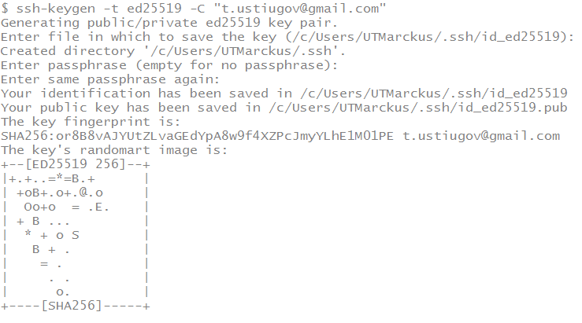
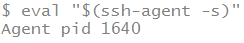
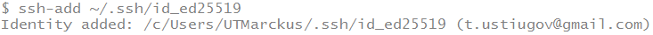
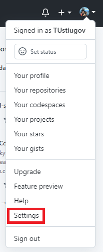
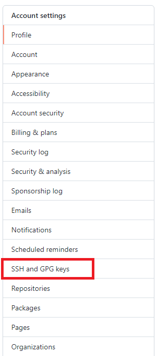
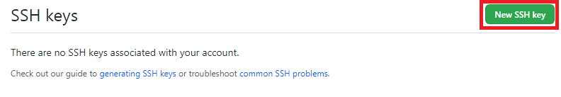
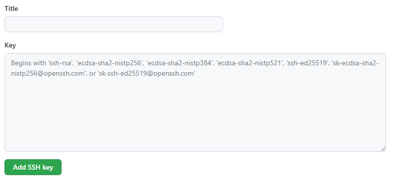
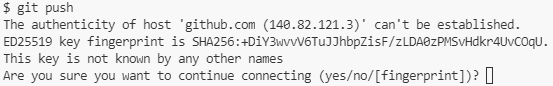

# Создание и использование SSH-ключей в Windows

## Создание SSH-ключа

Откройте терминал и введите:
```bash
ssh-keygen -t ed25519 -C "your_email@example.com"
```
где ***your_email@example.com*** - ваш e-mail.
Далее будут заданы вопросы (где будут располагаться ключи, пароль, подтверждение пароля) для ответа на которые рекомендую просто нажать `Enter`:



После этого введите в терминале для запуска ssh-агента:
```bash
eval "$(ssh-agent -s)"
```



И последний шаг введите в терминале:
```bash
ssh-add ~/.ssh/id_ed25519
```



## Добавление ключа в GitHub.

Перейдите в папку `C:\Users\"NickName"\.ssh`, где ***NickName*** - ваш аккаунт Windows. Откройте в любом текстовом редакторе (блокнот) файл `id_ed25519.pub`. Начинаться он должен примерно так: `ssh-ed25519 `. Скопируйте в буфер обмена все его содержимое (Ctrl+A -> Ctrl+C).

Откройте GitHub и откройте `Settings`:



Потом перейдите в раздел `SSH and GPG keys`:



Нажмите на кнопку `New SSH key`:



В поле `Title` введите любое название для ключа, а в поле `Key` вставьте ключь (Ctrl+V) который вы скопировали из файла `id_ed25519.pub`. Нажмите на кнопку `Add SSH key`.



На вашу почту должно прийти письмо с подтверждением добавления ключа.

При первом обращении к GitHub в терминале у вас спросят хотите ли продолжить, введите `yes` и нажмите `enter`:

